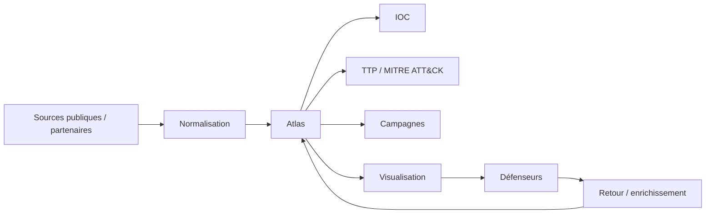

# HashCode CyberThreat Atlas

> Cartographie open source des menaces numériques observées en Afrique et de leurs indicateurs techniques.

**Domaine:** Cybersecurity · **Programme:** HashCode Global Impact · **Statut:** Research / MVP discovery

## Problème
Les équipes ont besoin de données structurées sur les campagnes, infrastructures et techniques de menace pour mieux comprendre leur exposition.

## Vision
Créer une base collaborative, documentée et exploitable par chercheurs, défenseurs, CERT/CSIRT et organisations autorisées.

## Cartographie

## MVP
Schéma de données, ingestion contrôlée, indicateurs, campagnes, TTP, recherche, provenance et visualisation.

## Sécurité
Pas de publication de données sensibles ou d'éléments permettant de faciliter une attaque. Chaque donnée doit avoir une provenance et un niveau de confiance.

## Impact
Indicateurs utiles, organisations informées, temps de partage du renseignement et qualité/provenance des données.

## Contribuer
Voir : https://github.com/HashCode-Reboot/hashcode-contributors

**Doctrine HashCode:** *Build for Africa. Scale for Humanity.*