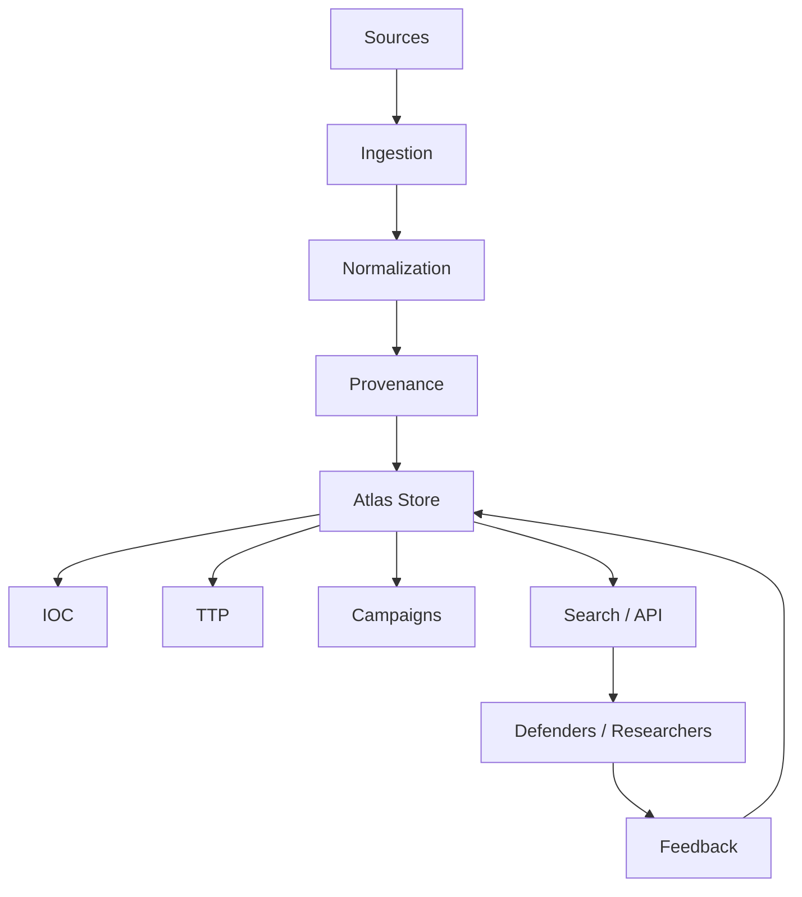

# Architecture — CyberThreat Atlas

## Principes

Chaque élément doit conserver provenance, date, niveau de confiance et contexte. Les données sensibles doivent être filtrées avant publication. L'objectif est d'améliorer la défense, pas de faciliter l'abus.